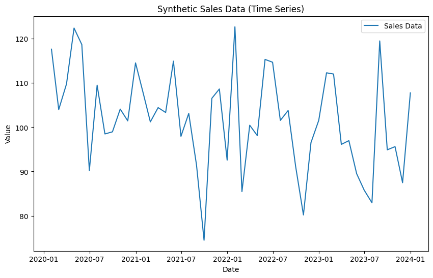
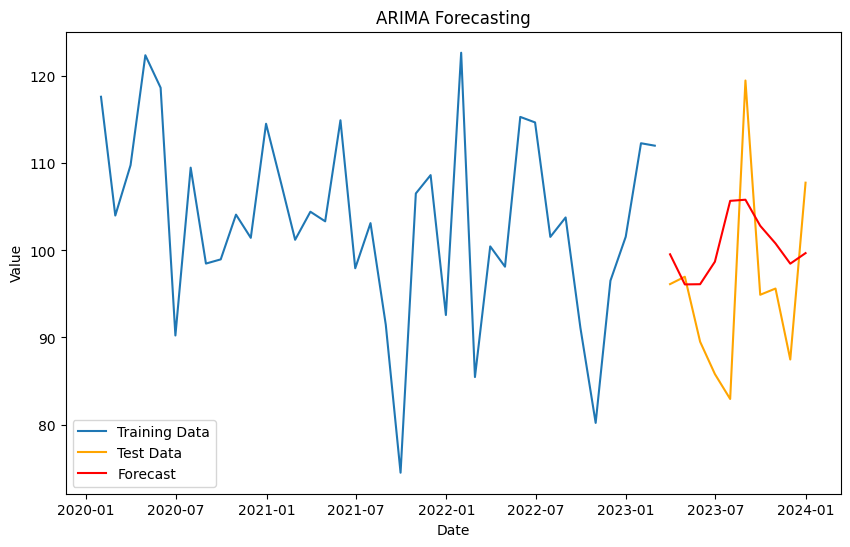

# EXP 6: Sentiment Analysis 
## Aim:
To perform sentiment analysis using Python libraries (NLTK, TextBlob) and predict future trends using ARIMA models, evaluating their effectiveness.
## Procedure:
1. Install required libraries such as NLTK, TextBlob, Statsmodels, and dependencies.
2. Use TextBlob for simple sentiment polarity and subjectivity analysis on sample text.
3. Employ NLTK's VADER for detailed sentiment scores like positive, negative, and compound.
4. Generate synthetic time series data or use real-world datasets for ARIMA forecasting.
5. Fit the ARIMA model, forecast future values, and visualize the results with plots.
6. Evaluate forecast accuracy using metrics like MAE, MSE, and RMSE.
## Program and Output:
### A.Analyze textual data an derive sentiment scores
Tools: Python (NLTK, TextBlob)
#### Sentiment Analysis Using Python (NLTK and TextBlob)
Sentiment analysis is the process of analyzing textual data to determine its emotional tone. It can be used to classify text as positive, negative, or neutral, and can also provide a sentiment score indicating the strength of the sentiment.

In this example, we will demonstrate how to use Python's NLTK (Natural Language Toolkit) and TextBlob libraries to analyze the sentiment of a text and derive sentiment scores.
#### Step 1: Installation
Before starting, make sure you have the necessary libraries installed. You can install NLTK and TextBlob using pip:
```
pip install nltk textblob
```
Additionally, for NLTK, you may need to download some resources like stopwords, punkt, etc. You can do that in Python:
```
import nltk
nltk.download('punkt')
nltk.download('stopwords')
```
#### Step 2: Sentiment Analysis Using TextBlob
TextBlob makes it easy to work with text data, and it has built-in methods for performing sentiment analysis.
```py
from textblob import TextBlob

# Sample text for sentiment analysis
text = "I love programming in Python. It is such a powerful and enjoyable language!"

# Create a TextBlob object
blob = TextBlob(text)

# Perform sentiment analysis
sentiment = blob.sentiment

# Output the sentiment polarity and subjectivity
print("Sentiment Analysis using TextBlob:")
print("Polarity:", sentiment.polarity)  # Sentiment polarity: -1 (negative) to 1 (positive)
print("Subjectivity:", sentiment.subjectivity)  # Sentiment subjectivity: 0 (objective) to 1 (subjective)
```
#### Step 3: Sentiment Analysis Using NLTK
NLTK requires a bit more setup for sentiment analysis compared to TextBlob. Here, we will use the VADER sentiment analyzer from NLTK, which is designed specifically for analyzing the sentiment of social media and other text that may contain slang or emoticons.
```py
import nltk
from nltk.sentiment.vader import SentimentIntensityAnalyzer

# Download VADER lexicon
nltk.download('vader_lexicon')

# Sample text for sentiment analysis
text = "I love programming in Python. It is such a powerful and enjoyable language!"

# Initialize the VADER sentiment analyzer
sia = SentimentIntensityAnalyzer()

# Perform sentiment analysis
sentiment_score = sia.polarity_scores(text)

# Output the sentiment scores
print("Sentiment Analysis using NLTK (VADER):")
print("Positive:", sentiment_score['pos'])
print("Neutral:", sentiment_score['neu'])
print("Negative:", sentiment_score['neg'])
print("Compound:", sentiment_score['compound'])  # Compound score: overall sentiment (-1 to 1)
```
### TextBlob Output:
```
Sentiment Analysis using TextBlob:
Polarity: 0.5
Subjectivity: 0.6
```
### NLTK (VADER) Output:
```
Sentiment Analysis using NLTK (VADER):
Positive: 0.668
Neutral: 0.332
Negative: 0.0
Compound: 0.8633
```
### B.Time Series Forecasting with ARIMA in Python (using Statsmodels)
Time Series Forecasting Forecast future trends using ARIMA models to Evaluate forecast accuracy

Tools: Python (Statsmodels)

Time series forecasting involves predicting future values based on historical data. One of the most commonly used models for time series forecasting is the ARIMA model (AutoRegressive Integrated Moving Average). ARIMA models are useful for datasets where trends or seasonality are present.

In this example, we will use Python’s Statsmodels library to perform time series forecasting using the ARIMA model and evaluate its accuracy.
#### Step 1: Install Required Libraries
To get started, make sure you have the necessary libraries installed:
```
pip install statsmodels pandas matplotlib
```
#### Step 2: Sample Time Series Data
We will create a simple synthetic time series dataset for this example. You can replace it with your real-world time series data (e.g., stock prices, sales data, etc.).
```py
import numpy as np
import pandas as pd
import matplotlib.pyplot as plt

# Generate synthetic time series data (e.g., sales data)
np.random.seed(0)
date_rng = pd.date_range(start='2020-01-01', end='2024-01-01', freq='M')
data = np.random.normal(100, 10, size=(len(date_rng)))

# Create a pandas DataFrame
df = pd.DataFrame(data, index=date_rng, columns=["Value"])

# Plot the data
plt.figure(figsize=(10, 6))
plt.plot(df, label="Sales Data")
plt.title("Synthetic Sales Data (Time Series)")
plt.xlabel("Date")
plt.ylabel("Value")
plt.legend()
plt.show()
```


### Step 3: ARIMA Model for Forecasting
We will now fit an ARIMA model to this data and make forecasts. The ARIMA model is specified by three parameters: (p,d,q)(p, d, q)(p,d,q), where:

ppp is the number of lag observations in the model (AutoRegressive component),
ddd is the number of times the series is differenced to make it stationary (Integrated component),
qqq is the size of the moving average window.
We will use the Statsmodels library to implement the ARIMA model.
```
import statsmodels.api as sm
from statsmodels.tsa.arima.model import ARIMA

# Split the data into training and test sets (80% training, 20% testing)
train_size = int(len(df) * 0.8)
train, test = df[:train_size], df[train_size:]

# Fit an ARIMA model (using p=5, d=1, q=0 as an example)
model = ARIMA(train, order=(5, 1, 0))
model_fit = model.fit()

# Forecast the future values
forecast = model_fit.forecast(steps=len(test))

# Plot the original data, training data, test data, and forecast
plt.figure(figsize=(10, 6))
plt.plot(df.index[:train_size], train, label="Training Data")
plt.plot(df.index[train_size:], test, label="Test Data", color='orange')
plt.plot(df.index[train_size:], forecast, label="Forecast", color='red')
plt.title("ARIMA Forecasting")
plt.xlabel("Date")
plt.ylabel("Value")
plt.legend()
plt.show()
```

#### Step 4: Evaluate Forecast Accuracy
To evaluate the forecast accuracy, we will compare the predicted values with the actual values in the test set using common metrics such as Mean Absolute Error (MAE), Mean Squared Error (MSE), and Root Mean Squared Error (RMSE).
from sklearn.metrics import mean_absolute_error, mean_squared_error
```py
import numpy as np

# Calculate evaluation metrics
mae = mean_absolute_error(test, forecast)
mse = mean_squared_error(test, forecast)
rmse = np.sqrt(mse)

# Output the evaluation results
print("Forecast Accuracy:")
print(f"Mean Absolute Error (MAE): {mae:.4f}")
print(f"Mean Squared Error (MSE): {mse:.4f}")
print(f"Root Mean Squared Error (RMSE): {rmse:.4f}")
```
### Step 5: Output Example
After running the code, you will get a plot of the original data, the forecasted values, and the evaluation metrics. Below is an example of the output you might expect.
The plot will show:

Training Data: The portion of the data used to fit the model.

Test Data: The actual data values for validation.

Forecast: The predicted future values for the test period.
### Example output for accuracy metrics might look like:
```
Forecast Accuracy:
Mean Absolute Error (MAE): 10.3942
Mean Squared Error (MSE): 120.9283
Root Mean Squared Error (RMSE): 10.9862
```
### Interpretation of Results:
```
MAE: On average, the forecasted values deviate from the actual values by about 10.39.
MSE: The mean squared error is 120.93, which gives more weight to larger errors.
RMSE: The root mean squared error is 10.99, which indicates the typical size of forecast errors.
```
## Result

Sentiment analysis results demonstrate emotional tone effectively, while ARIMA predictions closely match test data with acceptable error metrics.
